# AI 模块设计文档

> 🤖 智能对话交互模块 - 支持多模型、多提供商的 AI 对话能力

## 📑 目录导航

| 章节 | 描述 |
|------|------|
| [1. 模块概述](#1-模块概述) | AI 模块功能简介 |
| [2. 架构设计](#2-架构设计) | 整体架构与流程图 |
| [3. 类型定义](#3-类型定义) | 接口与类型定义 |
| [4. 功能实现](#4-功能实现) | 核心类实现详解 |
| [5. 配置说明](#5-配置说明) | 配置项详解 |
| [6. 支持的模型](#6-支持的模型) | 模型列表与对比 |
| [7. API 接口规范](#7-api-接口规范) | API 调用规范 |
| [8. Webview 集成](#8-webview-集成) | 前端界面集成 |
| [9. 错误处理](#9-错误处理) | 异常处理机制 |
| [10. 扩展性设计](#10-扩展性设计) | 扩展与定制 |

---

## 1. 模块概述

### 1.1 功能特性

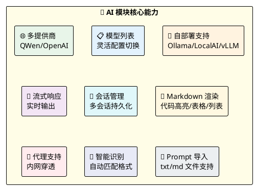

### 1.2 模块定位

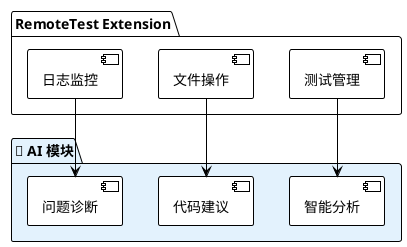

---

## 2. 架构设计

### 2.1 整体架构

```plantuml
@startuml
!theme plain
skinparam componentStyle rectangle

package "🖥️ AIChatViewProvider" #E3F2FD {
    [ModelSelect\n🔽 模型选择] as ModelSelect
    [ChatPanel\n💬 对话面板] as ChatPanel
    [MessageList\n📝 消息列表] as MessageList
}

package "🧠 AIChat" #E8F5E9 {
    [sessions[]\n📚 会话历史] as Sessions
    [provider\n🔌 提供商实例] as Provider
    [sessionManager\n📁 会话管理器] as SessionMgr
}

package "🔌 AIProvider (Strategy Pattern)" #FFF3E0 {
    [QWenProvider\n🟡 通义千问] as QWen
    [OpenAIProvider\n🟢 OpenAI兼容] as OpenAI
    [Custom Providers\n🔵 自部署模型] as Custom
}

package "🌐 AI APIs" #F3E5F5 {
    [QWen API\n阿里云] as QWenAPI
    [OpenAI API\n官方/兼容] as OpenAIAPI
    [Self-hosted APIs\nOllama/LocalAI/vLLM] as SelfAPI
}

ModelSelect --> Provider
ChatPanel --> Sessions
MessageList --> SessionMgr

Sessions --> Provider
Provider --> QWen
Provider --> OpenAI
Provider --> Custom

QWen --> QWenAPI
OpenAI --> OpenAIAPI
Custom --> SelfAPI

@enduml
```

### 2.2 对话流程

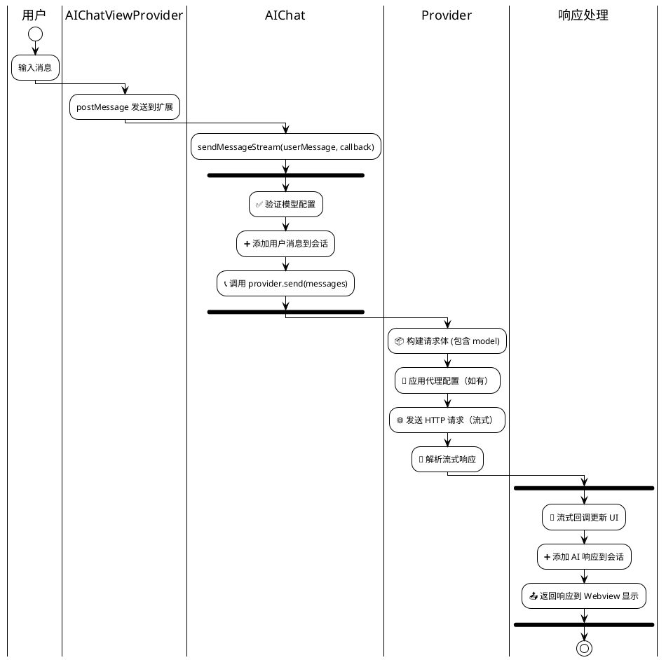

### 2.3 Provider 模式

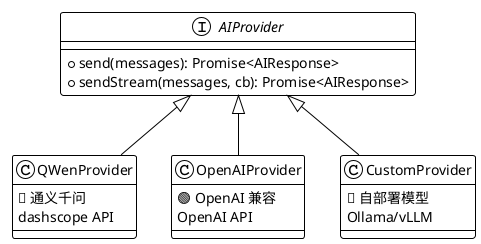

**Provider 自动识别规则**：

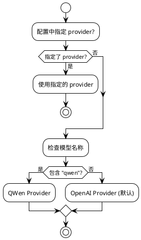

---

## 3. 类型定义

### 3.1 消息接口

```typescript
interface AIMessage {
    role: 'user' | 'assistant' | 'system';  // 消息角色
    content: string;                         // 消息内容
}
```

**角色说明**：

| 角色 | 图标 | 说明 | 使用场景 |
|------|------|------|----------|
| `system` | ⚙️ | 系统消息 | 设定 AI 行为和角色 |
| `user` | 👤 | 用户消息 | 用户的提问或输入 |
| `assistant` | 🤖 | 助手消息 | AI 的回复 |

### 3.2 响应接口

```typescript
interface AIResponse {
    content: string;    // AI 回复内容
    error?: string;     // 错误信息（可选）
}
```

### 3.3 提供商接口

```typescript
interface AIProvider {
    send(messages: AIMessage[]): Promise<AIResponse>;
    sendStream(messages: AIMessage[], onChunk: (chunk: string) => void): Promise<AIResponse>;
}
```

### 3.4 配置接口

```typescript
type AIProviderType = 'qwen' | 'openai';

interface AIConfig {
    models: AIModelConfig[];    // 模型列表
    defaultModel?: string;      // 默认模型名称
    proxy?: string;             // 全局代理（host:port）
}

interface AIModelConfig {
    name: string;               // 模型名称
    provider?: AIProviderType;  // 提供商类型（可选）
    apiKey?: string;            // API 密钥（可选）
    apiUrl?: string;            // 自定义 API 地址（可选）
}
```

### 3.5 会话接口

```typescript
interface ChatSession {
    id: string;
    title: string;
    messages: AIMessage[];
    createdAt: number;
    updatedAt: number;
}
```

---

## 4. 功能实现

### 4.1 AIChat 类

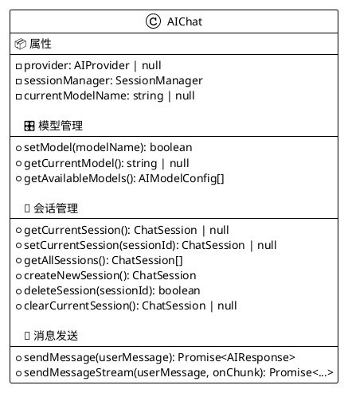

### 4.2 AIProviderImpl 类

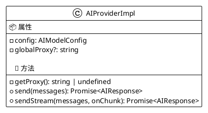

### 4.3 SessionManager 类

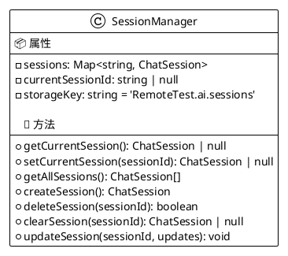

---

## 5. 配置说明

### 5.1 配置结构图

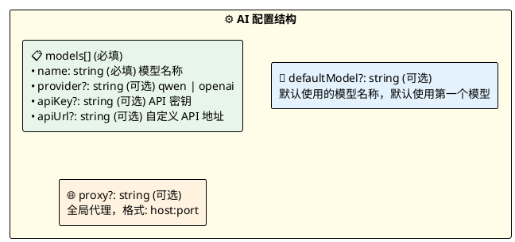

### 5.2 配置示例

#### 基本配置

```json
{
  "ai": {
    "models": [
      {
        "name": "qwen-turbo",
        "provider": "qwen",
        "apiKey": "your-qwen-api-key"
      },
      {
        "name": "gpt-4",
        "provider": "openai",
        "apiKey": "your-openai-api-key",
        "apiUrl": "https://api.openai.com/v1/chat/completions"
      }
    ],
    "defaultModel": "qwen-turbo"
  }
}
```

#### 自部署模型配置

```json
{
  "ai": {
    "models": [
      {
        "name": "local-llm",
        "provider": "openai",
        "apiUrl": "http://localhost:8000/v1/chat/completions"
      }
    ],
    "defaultModel": "local-llm"
  }
}
```

#### 代理配置

```json
{
  "ai": {
    "models": [
      {
        "name": "gpt-4",
        "apiKey": "your-api-key"
      }
    ],
    "proxy": "proxy.company.com:8080"
  }
}
```

### 5.3 配置字段说明

| 字段 | 必填 | 图标 | 说明 |
|------|:----:|------|------|
| `models` | ✅ | 📋 | 模型配置列表 |
| `models[].name` | ✅ | 🏷️ | 模型名称 |
| `models[].provider` | ❌ | 🔌 | 提供商类型：`qwen` 或 `openai` |
| `models[].apiKey` | ❌ | 🔑 | API 密钥，自部署模型可能不需要 |
| `models[].apiUrl` | ❌ | 🌐 | 自定义 API 地址 |
| `defaultModel` | ❌ | 🎯 | 默认使用的模型名称 |
| `proxy` | ❌ | 🔐 | 全局代理，格式 `host:port` |

---

## 6. 支持的模型

### 6.1 模型对比总览

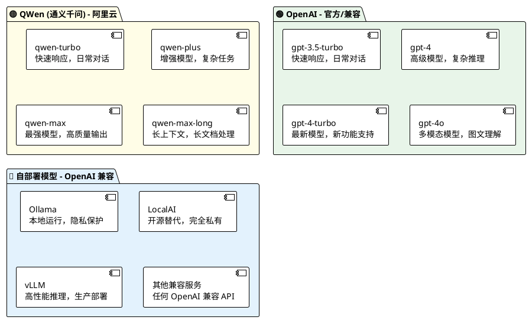

### 6.2 QWen 模型详情

| 模型名称 | 图标 | 说明 | 适用场景 |
|----------|:----:|------|----------|
| qwen-turbo | ⚡ | 快速响应模型 | 日常对话、快速问答 |
| qwen-plus | 🚀 | 增强模型 | 复杂任务、代码生成 |
| qwen-max | 👑 | 最强模型 | 高质量输出、复杂推理 |
| qwen-max-longcontext | 📚 | 长上下文模型 | 长文档处理 |

### 6.3 OpenAI 模型详情

| 模型名称 | 图标 | 说明 | 适用场景 |
|----------|:----:|------|----------|
| gpt-3.5-turbo | ⚡ | 快速响应模型 | 日常对话、快速问答 |
| gpt-4 | 🧠 | 高级模型 | 复杂推理、代码生成 |
| gpt-4-turbo | 🆕 | 最新模型 | 最新功能支持 |
| gpt-4o | 🎨 | 多模态模型 | 图文理解 |

### 6.4 自部署模型支持

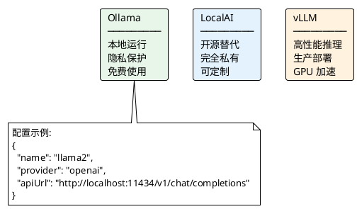

---

## 7. API 接口规范

### 7.1 QWen API

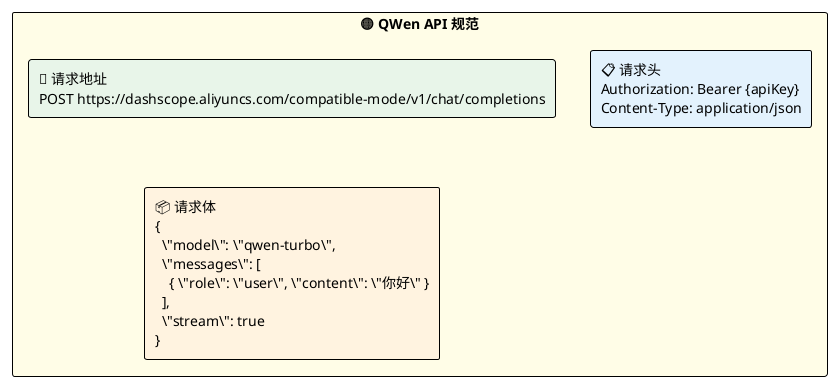

### 7.2 OpenAI API

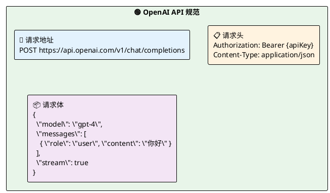

---

## 8. Webview 集成

### 8.1 界面布局

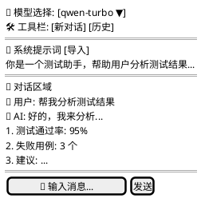

### 8.2 消息通信流程

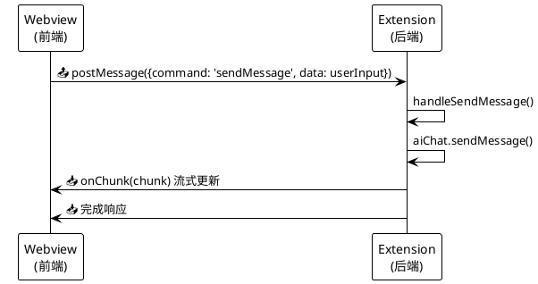

### 8.3 命令类型

| 命令 | 方向 | 说明 |
|------|------|------|
| `sendMessage` | Webview → Extension | 发送用户消息 |
| `switchModel` | Webview → Extension | 切换模型 |
| `getModels` | Webview → Extension | 获取可用模型列表 |
| `newSession` | Webview → Extension | 创建新会话 |
| `deleteSession` | Webview → Extension | 删除会话 |
| `onChunk` | Extension → Webview | 流式响应块 |
| `onComplete` | Extension → Webview | 响应完成 |
| `onError` | Extension → Webview | 错误通知 |

### 8.4 Markdown 渲染

| 语法 | 渲染效果 | 图标 |
|------|----------|:----:|
| `**粗体**` | **粗体** | 𝐁 |
| `*斜体*` | *斜体* | 𝐼 |
| `` `代码` `` | `代码` | 💻 |
| ` ```代码块``` ` | 代码块 | 📝 |
| `# 标题` | H1-H4 标题 | 📌 |
| `- 列表项` | 无序列表 | 📋 |
| `> 引用` | 引用块 | 💬 |
| `[链接](url)` | 超链接 | 🔗 |

---

## 9. 错误处理

### 9.1 错误处理流程

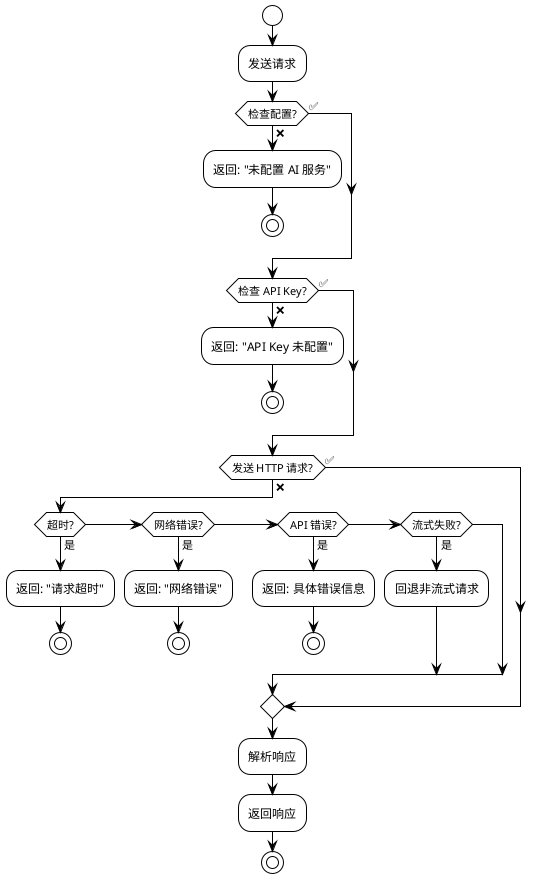

### 9.2 错误类型表

| 错误场景 | 图标 | 处理方式 |
|----------|:----:|----------|
| 未配置 AI 服务 | ⚙️ | 返回错误提示 |
| API Key 未配置 | 🔑 | 返回具体提示 |
| API 请求超时 | ⏱️ | 60 秒超时，返回错误 |
| API 返回错误 | 🚫 | 解析错误信息并返回 |
| 网络错误 | 🌐 | 捕获异常并返回错误信息 |
| 流式请求失败 | 📉 | 回退到非流式请求 |

---

## 10. 扩展性设计

### 10.1 添加新模型

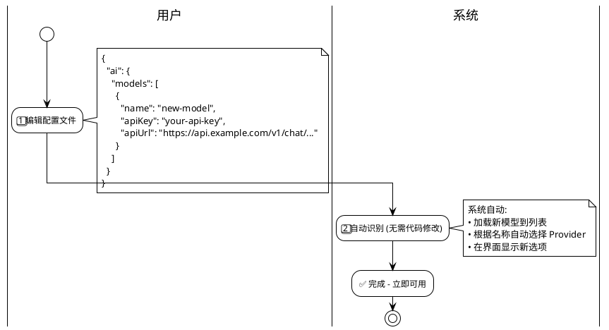

### 10.2 Agent 模式预留

```plantuml
@startuml
!theme plain

package "🔧 ToolRegistry" #E3F2FD {
    [📂 FileTool\n文件操作] as FileTool
    [💻 CmdTool\n命令执行] as CmdTool
    [📋 LogTool\n日志分析] as LogTool
}

|工具名称|描述|参数|
|readFile|读取文件内容|path: string|
|writeFile|写入文件内容|path, content: string|
|executeCmd|执行命令|command: string|
|analyzeLog|分析日志文件|logPath, pattern: string|
|uploadFile|上传文件到服务器|localPath: string|
|downloadLog|下载日志文件|remotePath: string|

@enduml
```

---

## 11. 自定义系统 Prompt

### 11.1 功能概述

```plantuml
@startuml
!theme plain

rectangle "📝 自定义系统 Prompt" #FFFDE7 {
    
    rectangle "功能特性" #E8F5E9 {
        ✅ 直接在界面输入自定义 Prompt
        ✅ 从文件导入 Prompt（支持 .txt 和 .md 文件）
        ✅ 可编辑后使用
    }
    
    rectangle "消息结构" #E3F2FD {
        messages = [
        { role: 'system', content: customPrompt },
        { role: 'user', content: userMessage },
        // ... 历史消息
        ]
    }
    
}

@enduml
```

### 11.2 文件导入支持

| 格式 | 图标 | 说明 |
|------|:----:|------|
| `.txt` | 📄 | 纯文本格式 |
| `.md` | 📝 | Markdown 格式 |

---

## 12. 性能考虑

```plantuml
@startuml
!theme plain

rectangle "⚡ 性能优化策略" #FFFDE7 {
    
    rectangle "⏱️ 超时控制\nAPI 请求设置 60 秒超时，避免长时间等待" as T1 #E8F5E9
    
    rectangle "💾 会话存储\n使用 VSCode 全局状态，持久化会话历史" as T2 #E3F2FD
    
    rectangle "🌊 流式响应\n支持流式响应，实时显示 AI 输出，提升用户体验" as T3 #FFF3E0
    
    rectangle "🔄 异步请求\n使用异步请求不阻塞 UI，保持界面响应" as T4 #F3E5F5
    
    rectangle "🔐 代理支持\n支持代理配置，适用于网络隔离环境" as T5 #E0F7FA
    
}

@enduml
```

---

## 13. 测试覆盖

| 测试类型 | 图标 | 测试文件 |
|----------|:----:|----------|
| 模型配置验证 | ✅ | `test/suite/ai.test.ts` |
| QWen 提供商 | 🟡 | `test/suite/ai.test.ts` |
| OpenAI 提供商 | 🟢 | `test/suite/ai.test.ts` |
| 流式响应 | 🌊 | `test/suite/ai.test.ts` |
| 会话管理 | 📁 | `test/suite/ai.test.ts` |
| 错误处理 | ⚠️ | `test/suite/ai.test.ts` |
| 代理配置 | 🔐 | `test/suite/ai.test.ts` |
| 自部署模型 | 🔵 | `test/suite/ai.test.ts` |
| 视图集成 | 🖥️ | `test/suite/aiChatView.test.ts` |
| 配置验证 | ⚙️ | `test/suite/configValidator.test.ts` |

---

[返回顶部](#ai-模块设计文档)
