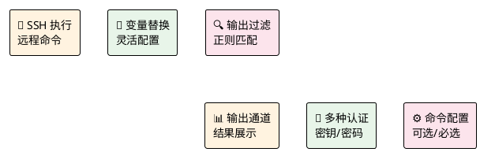
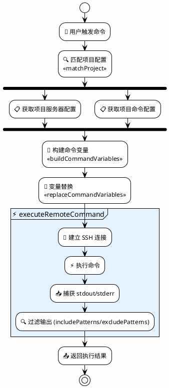
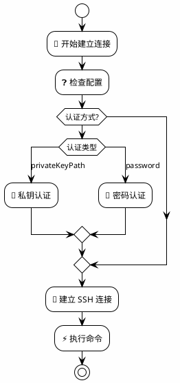
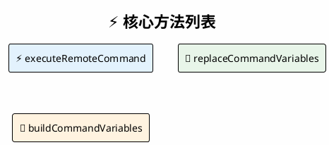
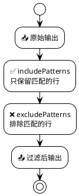
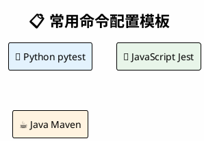

# 命令执行模块 (CommandExecutor Module)

> ⚡ 远程命令执行引擎 - 通过 SSH 在远程服务器执行命令并处理输出

## 📑 目录导航

| 章节 | 描述 |
|------|------|
| [1. 模块概述](#1-模块概述) | 功能简介与核心能力 |
| [2. 架构设计](#2-架构设计) | 整体架构与执行流程 |
| [3. 类型定义](#3-类型定义) | 接口与变量定义 |
| [4. 功能实现](#4-功能实现) | 核心方法详解 |
| [5. 使用示例](#5-使用示例) | 配置与代码示例 |
| [6. 错误处理](#6-错误处理) | 异常处理机制 |

---

## 1. 模块概述

### 1.1 核心能力



### 1.2 功能特性

| 特性 | 图标 | 说明 |
|------|:----:|------|
| SSH 远程执行 | 🔌 | 通过 SSH 协议在远程服务器执行命令 |
| 变量替换 | 📝 | 支持文件路径等变量动态替换 |
| 输出过滤 | 🔍 | 支持包含/排除正则模式过滤 |
| 多认证方式 | 🔐 | 支持密钥认证和密码认证 |
| 输出通道 | 📊 | 支持 LogOutputChannel 和普通 OutputChannel |

---

## 2. 架构设计

### 2.1 整体架构

```plantuml
@startuml
!theme plain
skinparam componentStyle rectangle
skinparam backgroundColor #FEFEFE

package "⚡ CommandExecutor Module" as Module #E3F2FD {
    
    package "📝 replaceVariables()" as ReplaceFunc #FFF3E0 {
        [原始命令\npytest {filePath}] as RawCmd
        [变量替换] as Replace
        [替换后命令\npytest /tmp/test.py] as ReplacedCmd
        RawCmd -> Replace -> ReplacedCmd
    }
    
    package "⚡ execute()" as ExecFunc #E8F5E9 {
        [SSH 连接\n🔌 建立] as SSHConn
        [执行命令\n⚡ 远程执行] as Exec
        [过滤输出\n🔍 正则匹配] as FilterOut
        SSHConn -> Exec -> FilterOut
    }
    
    ReplaceFunc --> ExecFunc : 替换后命令
}

@enduml
```

### 2.2 执行流程



### 2.3 SSH 连接机制



---

## 3. 类型定义

### 3.1 命令配置接口

```typescript
interface CommandConfig {
    name: string;                      // 命令名称
    executeCommand: string;            // 要执行的命令（支持变量）
    runnable?: boolean;                // 是否可执行
    selectable?: boolean;              // 是否为可选命令
    includePatterns?: string[];        // 包含匹配模式
    excludePatterns?: string[];        // 排除匹配模式
    clearOutputBeforeRun?: boolean;    // 执行前清空输出
}
```

### 3.2 命令变量接口

```typescript
interface CommandVariables {
    filePath: string;       // 远程文件完整路径
    fileName: string;       // 远程文件名
    fileDir: string;        // 远程文件所在目录
    localPath: string;      // 本地文件完整路径
    localDir: string;       // 本地文件所在目录
    localFileName: string;  // 本地文件名
    remoteDir: string;      // 远程工程目录
}
```

### 3.3 支持的变量

```plantuml
@startuml
!theme plain
skinparam backgroundColor #FEFEFE

title 📝 命令变量列表

|变量|说明|示例值|
|<#E3F2FD>{filePath}|远程文件完整路径|/tmp/RemoteTest/tests/...|
|<#E8F5E9>{fileName}|远程文件名|test_example.py|
|<#FFF3E0>{fileDir}|远程文件所在目录|/tmp/RemoteTest/tests|
|<#FCE4EC>{localPath}|本地文件完整路径|D:\project\tests\...|
|<#E3F2FD>{localDir}|本地文件所在目录|D:\project\tests|
|<#E8F5E9>{localFileName}|本地文件名|test_example.py|
|<#FFF3E0>{remoteDir}|远程工程目录|/tmp/RemoteTest|

@enduml
```

### 3.4 过滤模式

| 模式 | 图标 | 行为 | 使用场景 |
|------|:----:|------|----------|
| includePatterns | ✅ | 只保留匹配正则的行 | 只查看错误和失败信息 |
| excludePatterns | ❌ | 排除匹配正则的行 | 过滤掉调试信息 |

---

## 4. 功能实现

### 4.1 核心方法



**⚡ executeRemoteCommand:**
- 执行指定命令并返回过滤后的输出

**参数:**
- command: 要执行的命令字符串
- outputChannel?: 可选的输出通道
- serverConfig?: 服务器配置
- commandConfig?: 命令配置（包含过滤规则）

**返回值:**
`Promise<{ stdout, stderr, code, filteredOutput }>`

**📝 replaceCommandVariables:**
- 替换命令中的变量

**参数:**
- command: 包含变量的命令字符串
- variables: 命令变量对象

**返回值:**
`string: 替换后的命令`

**🔧 buildCommandVariables:**
- 构建命令变量对象

**参数:**
- localFilePath: 本地文件路径
- remoteFilePath: 远程文件路径
- remoteDir: 远程目录

**返回值:**
`CommandVariables: 命令变量对象`

### 4.2 输出过滤流程



---

## 5. 使用示例

### 5.1 基本使用

```typescript
import { executeRemoteCommand } from './core/sshClient';

const result = await executeRemoteCommand('npm test');
console.log('Filtered output:', result.filteredOutput);
```

### 5.2 配置文件示例

```json
{
    "projects": [
        {
            "name": "项目A",
            "localPath": "D:\\projectA",
            "server": {
                "host": "192.168.1.100",
                "port": 22,
                "username": "root",
                "password": "",
                "remoteDirectory": "/tmp/projectA"
            },
            "commands": [
                {
                    "name": "运行测试",
                    "executeCommand": "pytest {filePath} -v",
                    "includePatterns": ["PASSED", "FAILED", "ERROR"],
                    "clearOutputBeforeRun": true
                }
            ]
        }
    ]
}
```

### 5.3 常用命令配置



**🐍 Python pytest:**

```json
{
  "name": "运行测试",
  "executeCommand": "cd {remoteDir} && pytest {filePath} -v",
  "includePatterns": ["PASSED", "FAILED", "ERROR"]
}
```

**📜 JavaScript Jest:**

```json
{
  "name": "运行测试",
  "executeCommand": "cd {remoteDir} && npx jest {filePath}",
  "includePatterns": ["PASS", "FAIL", "✓", "✕"]
}
```

**☕ Java Maven:**

```json
{
  "name": "运行测试",
  "executeCommand": "cd {remoteDir} && mvn test -Dtest={fileName}",
  "includePatterns": ["Tests run:", "FAILURE", "ERROR"]
}
```

### 5.4 输出通道管理

| 通道名称 | 图标 | 用途 |
|----------|:----:|------|
| RemoteTest | 📋 | 插件自身的日志输出 |
| TestOutput | 📊 | 测试用例执行输出 |

可通过 `useLogOutputChannel` 配置控制 TestOutput 使用 LogOutputChannel 还是普通 OutputChannel。

---

## 6. 错误处理

**⚠️ 错误处理机制**:

| 错误场景 | 处理方式 |
|----------|----------|
| 命令不存在 | 返回非零退出码 |
| 正则表达式无效 | 降级为字符串匹配 |
| SSH 连接失败 | 显示错误消息 |
| 认证失败 | 检查密钥/密码配置 |

---

## 7. 测试覆盖

| 测试类型 | 图标 | 测试文件 |
|---------|:----:|---------|
| 命令执行 | ⚡ | `test/suite/commandExecutor.test.ts` |
| 变量替换 | 📝 | `test/suite/commandExecutor.test.ts` |
| 输出过滤 | 🔍 | `test/suite/commandExecutor.test.ts` |
| 错误处理 | ⚠️ | `test/suite/commandExecutor.test.ts` |

---

[返回顶部](#命令执行模块-commandexecutor-module)
