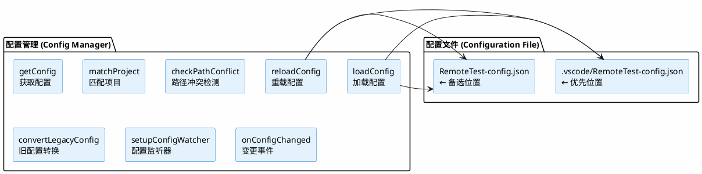
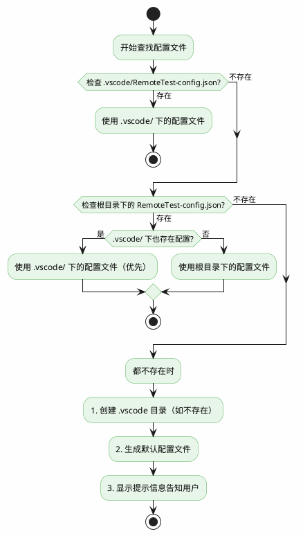
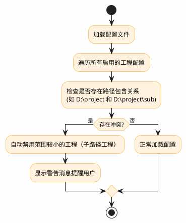
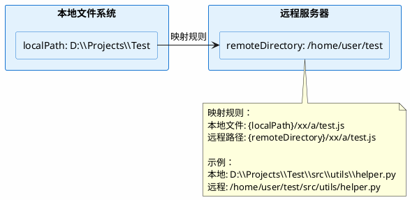
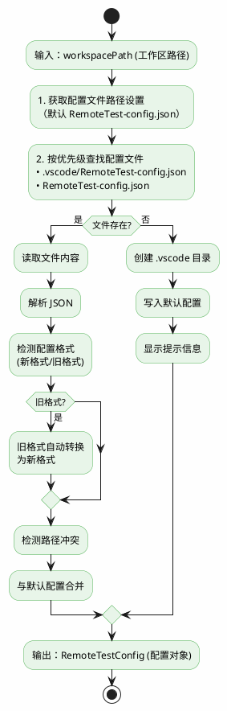
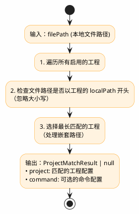

# ⚙️ 配置模块 (Config Module)

<div align="center">

**RemoteTest 配置系统详解**

[模块概述](#1-模块概述) • [设计方案](#2-设计方案) • [类型定义](#3-类型定义) • [功能实现](#4-功能实现)

</div>

---

## 📑 目录

- [1. 模块概述](#1-模块概述)
- [2. 设计方案](#2-设计方案)
- [3. 类型定义](#3-类型定义)
- [4. 功能实现](#4-功能实现)
- [5. 使用示例](#5-使用示例)
- [6. 错误处理](#6-错误处理)
- [7. 测试覆盖](#7-测试覆盖)

---

## 1. 模块概述

配置模块负责管理 RemoteTest 插件的所有配置信息，支持多工程多环境配置，每个工程拥有独立的服务器配置、命令配置和日志配置。模块支持自动创建默认配置文件、路径冲突检测、旧配置格式转换，并提供配置加载、获取和重载功能。

### 核心功能

| 功能 | 说明 |
|:----:|------|
| 📁 多工程配置 | 支持配置多个独立项目 |
| 🔍 路径匹配 | 根据本地文件路径自动匹配项目 |
| ⚠️ 冲突检测 | 自动检测并处理路径冲突 |
| 🔄 热重载 | 配置文件变更自动重载 |
| 📝 自动创建 | 配置文件不存在时自动创建默认配置 |

---

## 2. 设计方案

### 2.1 架构设计



### 2.2 配置文件查找策略



### 2.3 路径冲突检测



---

## 3. 类型定义

### 3.0 路径配置重要说明

> **⚠️ 重要：所有路径配置必须使用绝对路径**

| 配置项 | 路径类型 | 示例 |
|:------:|:--------:|------|
| `projects[].localPath` | 本地绝对路径 | `D:\Projects\Test` 或 `/home/user/projects/test` |
| `projects[].server.privateKeyPath` | 本地绝对路径 | `C:\Users\user\.ssh\id_rsa` 或 `/home/user/.ssh/id_rsa` |
| `projects[].server.remoteDirectory` | 远程绝对路径 | `/tmp/RemoteTest` 或 `/home/user/test` |
| `projects[].logs.directories[].path` | 远程绝对路径 | `/var/log/app` 或 `/home/user/logs` |
| `projects[].logs.downloadPath` | 本地绝对路径 | `D:\downloads` 或 `/home/user/downloads` |

**注意事项**：
- 本地路径格式根据操作系统而定：
  - Windows: `D:\path\to\file` 或 `C:\Users\user\...`
  - Linux/macOS: `/home/user/path/to/file`
- 远程路径格式取决于远程服务器操作系统（通常为 Linux，使用 `/` 开头的绝对路径）

### 3.1 完整配置结构

```typescript
interface RemoteTestConfig {
    projects: ProjectConfig[];  // 多工程配置数组
    ai: AIConfig;               // AI 服务配置（全局）
    refreshInterval?: number;   // 日志刷新间隔（全局，毫秒），默认 0（禁用自动刷新）
}

interface ProjectConfig {
    name: string;               // 工程名称
    localPath: string;          // 本地工程路径（用于路径匹配）
    enabled?: boolean;          // 是否启用，默认 true
    server: ServerConfig;       // 服务器连接配置
    commands: CommandConfig[];  // 命令配置数组（支持多个命令）
    logs: ProjectLogsConfig;    // 日志配置
}
```

### 3.2 服务器配置

```typescript
interface ServerConfig {
    host: string;              // 服务器主机地址，如 "192.168.1.100"
    port: number;              // SSH 端口，默认 22
    username: string;          // 登录用户名
    password: string;          // 登录密码（密码认证）
    privateKeyPath: string;    // 私钥路径（密钥认证，优先于密码）
    remoteDirectory: string;   // 远程工作目录（上传文件的目标目录）
}
```

**字段说明**：

| 字段 | 类型 | 必填 | 默认值 | 说明 |
|:----:|:----:|:----:|:------:|------|
| host | string | ✅ | "192.168.1.100" | 目标服务器 IP 地址 |
| port | number | ✅ | 22 | SSH 连接端口 |
| username | string | ✅ | "root" | SSH 登录用户名 |
| password | string | ❌ | "" | SSH 登录密码（密码认证） |
| privateKeyPath | string | ❌ | "" | SSH 私钥路径（密钥认证，优先于密码） |
| remoteDirectory | string | ✅ | "/tmp/RemoteTest" | 远程工作目录，上传文件的目标目录 |

**认证方式**：

| 认证方式 | 配置 | 优先级 |
|:--------:|:----:|:------:|
| 密钥认证 | privateKeyPath | 高（优先使用） |
| 密码认证 | password | 低（密钥不存在时使用） |

**路径映射说明**：



### 3.3 命令配置

```typescript
interface CommandConfig {
    name: string;                      // 命令名称
    executeCommand: string;            // 要执行的命令（支持变量）
    selectable?: boolean;              // 是否为可选命令（用于右键菜单选择）
    includePatterns?: string[];        // 包含匹配模式（只保留匹配的行）
    excludePatterns?: string[];        // 排除匹配模式（排除匹配的行）
    colorRules?: OutputColorRule[];    // 颜色规则（可选，使用内置规则）
}

interface OutputColorRule {
    pattern: string;                   // 匹配模式
    color: 'red' | 'green' | 'yellow' | 'blue' | 'cyan' | 'magenta' | 'white' | 'gray';
}
```

**字段说明**：

| 字段 | 类型 | 必填 | 默认值 | 说明 |
|:----:|:----:|:----:|:------:|------|
| name | string | ✅ | - | 命令名称，用于多命令选择时显示 |
| executeCommand | string | ✅ | "pytest {filePath} -v" | 执行的命令，支持变量替换 |
| selectable | boolean | ❌ | false | 是否为可选命令（用于右键菜单选择文件后执行） |
| includePatterns | string[] | ❌ | ["error", "failed", "FAILED", "Error", "ERROR"] | 只保留匹配这些模式的行 |
| excludePatterns | string[] | ❌ | [] | 排除匹配这些模式的行 |
| colorRules | OutputColorRule[] | ❌ | 内置规则 | 输出颜色规则 |

**selectable 属性说明**：

| selectable | 命令包含变量 | 快捷命令面板 | 右键菜单 |
|:----------:|:------------:|:------------:|:--------:|
| false 或未设置 | 否 | ✅ 显示 | ❌ 不显示 |
| true | 是 | ❌ 不显示 | ✅ 显示（选择文件后） |
| 任意 | 是 | ❌ 不显示 | 根据 selectable 决定 |

**使用场景**：
- `selectable: true`：用于需要选择文件后执行的命令（如运行测试），会在右键菜单中显示
- `selectable: false` 或不设置：用于无需选择文件的快捷命令（如构建、部署），会在快捷命令面板显示

**命令变量**：

| 变量 | 说明 | 示例值 |
|:----:|------|--------|
| `{filePath}` | 远程文件完整路径 | `/tmp/RemoteTest/tests/test_example.py` |
| `{fileName}` | 远程文件名 | `test_example.py` |
| `{fileDir}` | 远程文件所在目录 | `/tmp/RemoteTest/tests` |
| `{localPath}` | 本地文件完整路径 | `D:\project\tests\test_example.py` |
| `{localDir}` | 本地文件所在目录 | `D:\project\tests` |
| `{localFileName}` | 本地文件名 | `test_example.py` |
| `{remoteDir}` | 远程工程目录 | `/tmp/RemoteTest` |

### 3.4 AI 配置

```typescript
type AIProviderType = 'qwen' | 'openai';

interface AIConfig {
    models: AIModelConfig[];    // 模型列表
    defaultModel?: string;      // 默认模型名称
    proxy?: string;             // 全局代理（host:port）
}

interface AIModelConfig {
    name: string;               // 模型名称
    provider?: AIProviderType;  // 提供商类型（可选）
    apiKey?: string;            // API 密钥（可选）
    apiUrl?: string;            // 自定义 API 地址（可选）
}
```

**字段说明**：

| 字段 | 类型 | 必填 | 默认值 | 说明 |
|:----:|:----:|:----:|:------:|------|
| models | AIModelConfig[] | ✅ | [] | 模型配置列表 |
| models[].name | string | ✅ | - | 模型名称 |
| models[].provider | 'qwen' \| 'openai' | ❌ | 自动识别 | 提供商类型 |
| models[].apiKey | string | ❌ | "" | API 密钥 |
| models[].apiUrl | string | ❌ | 默认地址 | 自定义 API 地址 |
| defaultModel | string | ❌ | 第一个模型 | 默认使用的模型 |
| proxy | string | ❌ | - | 全局代理，格式 `host:port` |

**provider 说明**：
- `qwen`：通义千问 API 格式
- `openai`：OpenAI API 格式（兼容大多数本地模型如 Ollama、vLLM）

**模型自动识别**（未配置 provider 时）：
- QWen 模型：名称包含 `qwen`
- 其他模型：默认使用 `openai` 格式

### 3.5 日志配置

```typescript
interface LogDirectoryConfig {
    name: string;                 // 目录显示名称
    path: string;                 // 远程目录路径
    projectName?: string;         // 关联的项目名称（可选）
}

interface ProjectLogsConfig {
    directories: LogDirectoryConfig[];  // 监控目录列表
    downloadPath: string;               // 下载路径
}
```

**字段说明**：

| 字段 | 类型 | 必填 | 默认值 | 说明 |
|:----:|:----:|:----:|:------:|------|
| directories | LogDirectoryConfig[] | ✅ | [] | 要监控的日志目录列表 |
| directories[].name | string | ✅ | - | 目录在界面显示的名称 |
| directories[].path | string | ✅ | - | 远程服务器上的目录路径 |
| directories[].projectName | string | ❌ | - | 关联的项目名称，用于自动获取服务器配置 |
| downloadPath | string | ✅ | "" | 日志下载保存路径（本地绝对路径） |

**全局刷新配置**：

| 字段 | 类型 | 必填 | 默认值 | 说明 |
|:----:|:----:|:----:|:------:|------|
| refreshInterval | number | ❌ | 0 | 全局日志刷新间隔，单位毫秒。设为 0 禁用自动刷新 |

---

## 4. 功能实现

### 4.1 核心函数

#### loadConfig(workspacePath: string): RemoteTestConfig

加载配置文件，如不存在则创建默认配置。



#### getConfig(): RemoteTestConfig

获取当前已加载的配置。

**返回值**：
- `RemoteTestConfig`: 当前配置对象

**注意**：如未调用 loadConfig，返回默认配置。

#### getEnabledProjects(): ProjectConfig[]

获取所有启用的工程配置。

**返回值**：
- `ProjectConfig[]`: 启用的工程列表

#### matchProject(filePath: string): ProjectMatchResult | null

根据本地文件路径匹配对应的工程配置。



#### reloadConfig(workspacePath?: string): RemoteTestConfig

重新加载配置文件。

**参数**：
- `workspacePath`: 工作区路径（可选，默认使用当前工作区）

**返回值**：
- `RemoteTestConfig`: 重新加载后的配置对象

**特性**：
- 如果配置发生变化，会触发 `onConfigChanged` 事件通知所有监听者

#### setupConfigWatcher(context: vscode.ExtensionContext): void

设置配置文件监听器，自动监听配置文件变化。

**FileSystemWatcher 监听事件**：

| 事件 | 说明 |
|------|------|
| onDidChange | 配置文件被修改时自动刷新 |
| onDidCreate | 配置文件被创建时自动加载 |
| onDidDelete | 配置文件被删除时使用默认配置 |

#### onConfigChanged 事件

配置变化事件，用于监听配置更新。

```typescript
import { onConfigChanged } from './config';

onConfigChanged((newConfig) => {
    console.log('配置已更新:', newConfig);
});
```

---

## 5. 使用示例

### 5.1 加载配置

```typescript
import { loadConfig, getConfig } from './config';

export function activate(context: vscode.ExtensionContext) {
    const workspacePath = vscode.workspace.workspaceFolders?.[0]?.uri.fsPath;
    if (workspacePath) {
        loadConfig(workspacePath);
    }
    
    const config = getConfig();
    console.log('Projects:', config.projects.length);
}
```

### 5.2 匹配工程

```typescript
import { matchProject } from './config';

function handleFileUpload(localFilePath: string) {
    const result = matchProject(localFilePath);
    if (result) {
        console.log('匹配到工程:', result.project.name);
        console.log('服务器:', result.project.server.host);
    } else {
        console.log('未找到匹配的工程配置');
    }
}
```

### 5.3 配置文件示例

```json
{
    "projects": [
        {
            "name": "项目A",
            "localPath": "D:\\projectA",
            "enabled": true,
            "server": {
                "host": "192.168.1.100",
                "port": 22,
                "username": "root",
                "password": "",
                "privateKeyPath": "",
                "remoteDirectory": "/tmp/projectA"
            },
            "commands": [
                {
                    "name": "运行测试",
                    "executeCommand": "pytest {filePath} -v",
                    "includePatterns": ["PASSED", "FAILED", "ERROR"]
                },
                {
                    "name": "运行覆盖率",
                    "executeCommand": "pytest {filePath} --cov",
                    "includePatterns": ["error", "failed", "%"]
                }
            ],
            "logs": {
                "directories": [
                    { "name": "应用日志", "path": "/var/log/projectA" }
                ],
                "downloadPath": "D:\\downloads\\projectA"
            }
        },
        {
            "name": "项目B",
            "localPath": "D:\\projectB",
            "enabled": true,
            "server": {
                "host": "192.168.1.200",
                "port": 22,
                "username": "test",
                "password": "",
                "privateKeyPath": "C:\\Users\\test\\.ssh\\id_rsa",
                "remoteDirectory": "/home/test/projectB"
            },
            "commands": [
                {
                    "name": "执行用例",
                    "executeCommand": "python {filePath}",
                    "includePatterns": ["error", "failed", "OK"],
                    "excludePatterns": ["traceback", "File"]
                }
            ],
            "logs": {
                "directories": [
                    { "name": "测试日志", "path": "/var/log/projectB" }
                ],
                "downloadPath": "D:\\downloads\\projectB"
            }
        }
    ],
    "ai": {
        "models": [
            {
                "name": "qwen-turbo",
                "provider": "qwen",
                "apiKey": "your-qwen-api-key"
            },
            {
                "name": "gpt-4",
                "provider": "openai",
                "apiKey": "your-openai-api-key",
                "apiUrl": "https://api.openai.com/v1/chat/completions"
            }
        ],
        "defaultModel": "qwen-turbo"
    },
    "refreshInterval": 0
}
```

---

## 6. 错误处理

| 错误场景 | 处理方式 |
|:---------|:---------|
| 配置文件不存在 | 自动创建默认配置文件 |
| JSON 解析失败 | 使用默认配置，记录错误日志 |
| 文件读取权限不足 | 使用默认配置，显示错误提示 |
| 配置项缺失 | 使用默认值填充缺失项 |
| 路径冲突 | 自动禁用冲突工程，显示警告 |

---

## 7. 测试覆盖

配置模块测试覆盖以下场景：

| 测试项 | 说明 |
|:-------|:-----|
| 默认配置验证 | 验证默认配置结构正确 |
| 多工程配置验证 | 验证多项目配置加载 |
| 路径匹配测试 | 验证文件路径匹配逻辑 |
| 路径冲突检测测试 | 验证冲突检测和处理 |
| 旧配置格式转换测试 | 验证旧格式自动转换 |
| AI 配置验证 | 验证 AI 模型配置 |

详见测试文件：`test/suite/config.test.ts`、`test/suite/multiProject.test.ts`

---

<div align="center">

**[返回顶部](#️-配置模块-config-module)**

</div>
