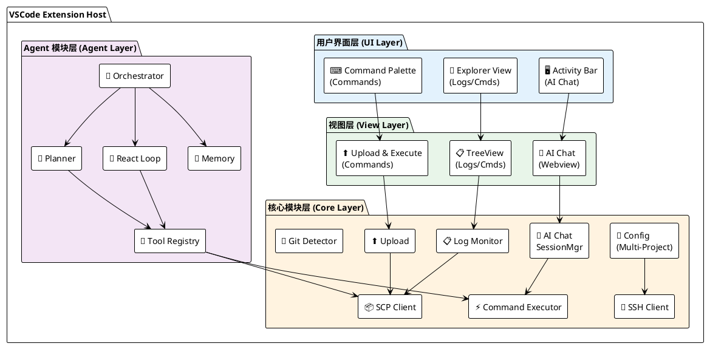
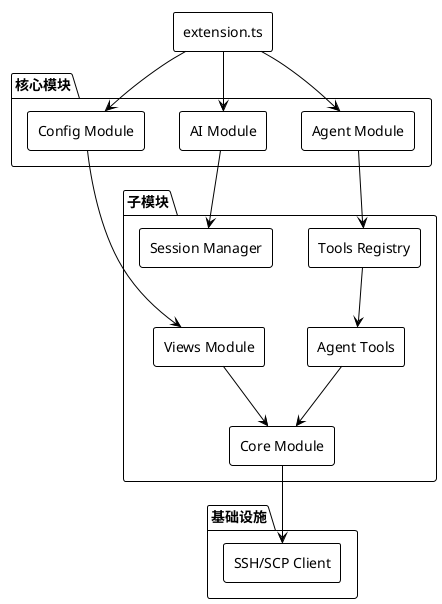
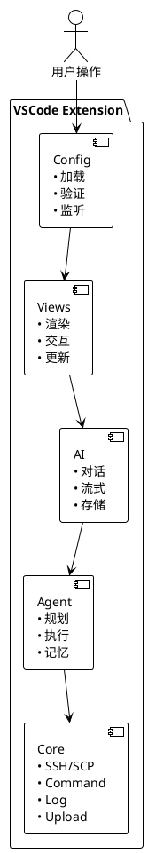
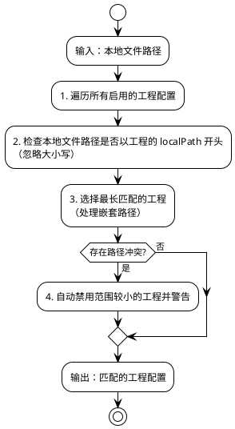
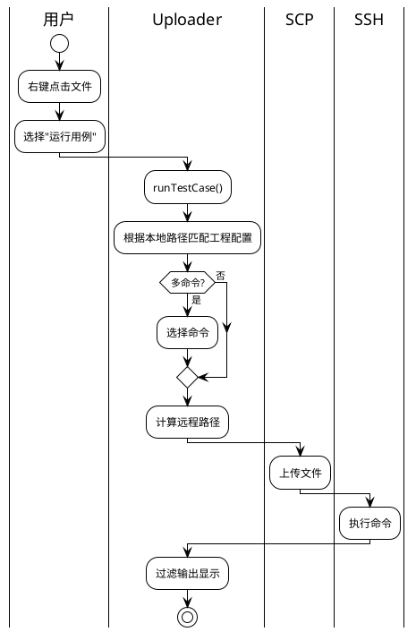
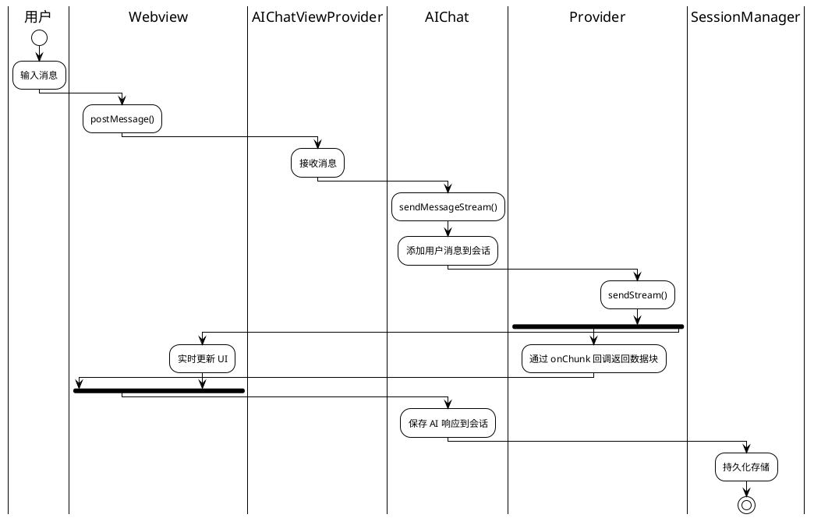
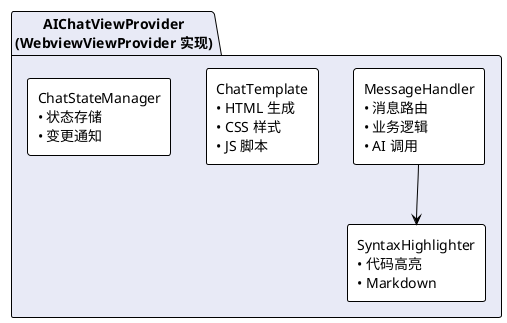
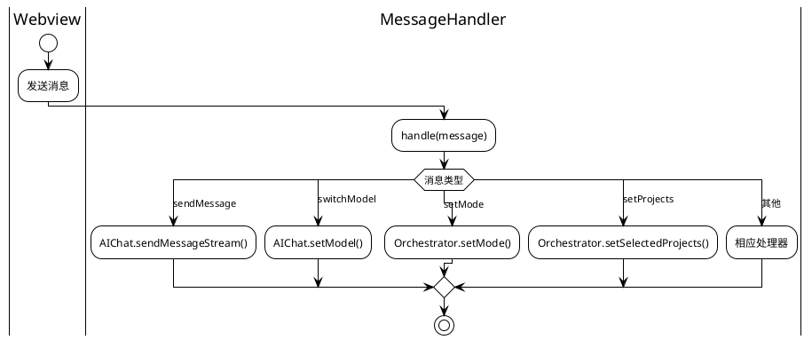

# 🏗️ RemoteTest 插件设计文档

<div align="center">

**系统架构与模块设计详解**

[概述](#1-概述) • [系统架构](#2-系统架构) • [模块设计](#3-模块概览) • [数据流](#7-数据流)

</div>

---

## 📑 目录

- [1. 概述](#1-概述)
- [2. 系统架构](#2-系统架构)
- [3. 模块概览](#3-模块概览)
- [4. 输出通道约束](#4-输出通道约束)
- [5. 配置结构](#5-配置结构)
- [6. 命令列表](#6-命令列表)
- [7. 数据流](#7-数据流)
- [8. 错误处理](#8-错误处理)
- [9. 性能考虑](#9-性能考虑)
- [10. 目录结构](#10-目录结构)
- [11. Views 模块架构](#11-views-模块架构)

---

## 1. 概述

RemoteTest 是一款 VSCode 插件，旨在简化测试工作流程，提供文件上传、命令执行、日志监控和 AI 对话功能。插件采用模块化设计，支持多工程多环境配置，通过 SSH/SCP 协议与远程服务器交互。

### 核心特性

| 特性 | 说明 |
|:----:|------|
| 🌐 多工程多环境 | 独立的服务器、命令和日志配置 |
| 📤 文件上传/同步 | 右键菜单操作，支持单文件和目录 |
| ⚡ 快捷命令 | 快速执行预定义命令 |
| 👀 修改监控 | 基于 Git 检测变更，一键上传 |
| 📋 日志监控 | 实时查看和下载远程日志 |
| 🤖 AI 对话 | 多模型支持，流式输出，Markdown 渲染 |
| 🔄 Agent 模式 | Ask/Plan/React 三种智能工作模式 |

---

## 2. 系统架构

### 整体架构图



### 模块依赖关系



---

## 3. 模块概览

### 模块职责表

| 模块 | 文件 | 职责 | 图标 |
|:----:|:----:|------|:----:|
| 配置模块 | `src/config/index.ts` | 管理多工程配置，支持路径匹配和冲突检测 | ⚙️ |
| 命令执行模块 | `src/core/commandExecutor.ts` | 通过 SSH 执行远程命令并过滤输出 | ⚡ |
| 日志监控模块 | `src/core/logMonitor.ts` | 通过 SCP 监控和下载远程日志文件 | 📋 |
| 文件上传模块 | `src/core/uploader.ts` | 文件上传和用例运行功能 | ⬆️ |
| AI 对话模块 | `src/ai/chat.ts` | 提供与 AI 模型的对话能力 | 🤖 |
| AI 提供商模块 | `src/ai/providers.ts` | AI 服务提供商实现（QWen、OpenAI） | 🔌 |
| 会话管理模块 | `src/ai/sessionManager.ts` | AI 对话会话的持久化管理 | 💾 |
| Agent 协调器 | `src/agent/orchestrator.ts` | Agent 模式协调和状态管理 | 🎯 |
| 工具注册器 | `src/agent/toolRegistry.ts` | Agent 工具注册和管理 | 🔧 |

### 模块交互图



---

## 4. 输出通道约束

插件**严格限制**只能有两个输出通道：

| 通道名称 | 用途 | 图标 |
|:--------:|------|:----:|
| `RemoteTest` | 插件自身信息输出（配置验证、错误信息） | 📝 |
| `TestOutput` | 命令执行输出（远程服务器返回的结果） | 📋 |

**使用方式**：

```typescript
import { getOutputChannelManager } from '../utils/outputChannel';

const channelManager = getOutputChannelManager();
const remoteTestChannel = channelManager.getRemoteTestChannel();
const testOutputChannel = channelManager.getTestOutputChannel();
```

---

## 5. 配置结构

### 5.1 配置文件位置

`{workspace}/.vscode/RemoteTest-config.json` 或 `{workspace}/RemoteTest-config.json`

### 5.2 配置接口

```typescript
interface RemoteTestConfig {
    projects: ProjectConfig[];      // 多工程配置数组
    ai: AIConfig;                   // AI 服务配置（全局）
    refreshInterval?: number;       // 日志刷新间隔（毫秒）
    textFileExtensions?: string[];  // 文本文件扩展名
    useLogOutputChannel?: boolean;  // 输出通道类型
}

interface ProjectConfig {
    name: string;                   // 工程名称
    localPath?: string;             // 本地工程路径（可选）
    enabled?: boolean;              // 是否启用（默认 true）
    server: ServerConfig;           // 服务器连接配置
    commands?: CommandConfig[];     // 命令配置数组（可选）
    logs?: ProjectLogsConfig;       // 日志配置（可选）
}
```

### 5.3 完整配置示例

```json
{
    "projects": [
        {
            "name": "项目A",
            "localPath": "D:\\projectA",
            "enabled": true,
            "server": {
                "host": "192.168.1.100",
                "port": 22,
                "username": "root",
                "password": "",
                "privateKeyPath": "",
                "remoteDirectory": "/tmp/projectA"
            },
            "commands": [
                {
                    "name": "运行测试",
                    "executeCommand": "pytest {filePath} -v",
                    "includePatterns": ["ERROR", "FAILED", "PASSED"],
                    "excludePatterns": [],
                    "runnable": true,
                    "clearOutputBeforeRun": true
                }
            ],
            "logs": {
                "directories": [
                    { "name": "应用日志", "path": "/var/log/projectA" }
                ],
                "downloadPath": "D:\\downloads\\projectA"
            }
        }
    ],
    "ai": {
        "models": [
            {
                "name": "qwen-turbo",
                "provider": "qwen",
                "apiKey": "your-qwen-api-key"
            },
            {
                "name": "gpt-4",
                "provider": "openai",
                "apiKey": "your-openai-api-key",
                "apiUrl": "https://api.openai.com/v1/chat/completions"
            }
        ],
        "defaultModel": "qwen-turbo",
        "proxy": "proxy.company.com:8080"
    },
    "refreshInterval": 0,
    "useLogOutputChannel": true
}
```

### 5.4 配置字段说明

#### 工程配置

| 字段 | 必填 | 说明 |
|:----:|:----:|------|
| `name` | ✅ | 项目名称 |
| `localPath` | ❌ | 本地工程路径，未配置时 Git 监控、文件上传不可用 |
| `enabled` | ❌ | 是否启用（默认 true） |
| `server` | ✅ | 服务器连接配置 |
| `commands` | ❌ | 命令配置数组 |
| `logs` | ❌ | 日志监控配置 |

#### 服务器配置

| 字段 | 必填 | 说明 |
|:----:|:----:|------|
| `host` | ✅ | 服务器 IP 地址 |
| `port` | ✅ | SSH 端口，默认 22 |
| `username` | ✅ | SSH 用户名 |
| `password` | ❌ | SSH 密码（密码认证） |
| `privateKeyPath` | ❌ | SSH 私钥路径（密钥认证，优先于密码） |
| `remoteDirectory` | ❌ | 远程工作目录，未配置时文件上传不可用 |

#### 命令配置

| 字段 | 说明 |
|:----:|------|
| `name` | 命令名称 |
| `executeCommand` | 执行命令（支持变量替换） |
| `includePatterns` | 包含匹配模式（正则表达式） |
| `excludePatterns` | 排除匹配模式（正则表达式） |
| `runnable` | 是否在"运行用例"中显示，默认 false |
| `clearOutputBeforeRun` | 执行前是否清空输出，默认 true |

#### 命令变量

| 变量 | 说明 | 配置要求 |
|:----:|------|----------|
| `{filePath}` | 远程文件完整路径 | 需要 localPath + remoteDirectory |
| `{fileName}` | 远程文件名 | 需要 localPath + remoteDirectory |
| `{fileDir}` | 远程文件所在目录 | 需要 localPath + remoteDirectory |
| `{localPath}` | 本地文件完整路径 | 需要 localPath |
| `{localDir}` | 本地文件所在目录 | 需要 localPath |
| `{localFileName}` | 本地文件名 | 需要 localPath |
| `{remoteDir}` | 远程工程目录 | 需要 remoteDirectory |

#### AI 配置

| 字段 | 说明 |
|:----:|------|
| `models` | 模型配置列表 |
| `models[].name` | 模型名称 |
| `models[].provider` | 提供商类型：`qwen` 或 `openai`（可选） |
| `models[].apiKey` | API 密钥（可选） |
| `models[].apiUrl` | 自定义 API 地址（可选） |
| `defaultModel` | 默认模型名称 |
| `proxy` | 全局代理，格式 `host:port` |

**provider 说明**：
- `qwen`：通义千问 API 格式
- `openai`：OpenAI API 格式（兼容大多数本地模型如 Ollama、vLLM）

**模型自动识别**（未配置 provider 时）：
- QWen 模型：名称包含 `qwen`
- 其他模型：默认使用 `openai` 格式

#### 全局配置

| 字段 | 说明 |
|:----:|------|
| `refreshInterval` | 日志刷新间隔（毫秒），0 表示禁用 |
| `useLogOutputChannel` | 输出通道类型，true 带时间戳，false 无时间戳 |
| `textFileExtensions` | 额外的文本文件扩展名列表 |

### 5.5 功能可用性矩阵

| 功能 | localPath | remoteDirectory | commands | logs |
|:----:|:---------:|:---------------:|:--------:|:----:|
| 快捷命令（无变量） | - | - | ✅ | - |
| 快捷命令（本地变量） | ✅ | - | ✅ | - |
| 快捷命令（远程变量） | - | ✅ | ✅ | - |
| 文件上传 | ✅ | ✅ | - | - |
| Git 变更监控 | ✅ | - | - | - |
| 日志监控 | - | - | - | ✅ |
| 运行用例 | ✅ | ✅ | ✅ | - |

### 5.6 路径匹配机制



---

## 6. 命令列表

| 命令 ID | 描述 | 触发方式 |
|:--------|:-----|:---------|
| `RemoteTest.runTestCase` | 运行用例 | 右键菜单 |
| `RemoteTest.uploadFile` | 上传文件 | 右键菜单 |
| `RemoteTest.syncFile` | 同步文件 | 右键菜单 |
| `RemoteTest.refreshQuickCommands` | 刷新快捷命令 | 工具栏 |
| `RemoteTest.executeQuickCommand` | 执行快捷命令 | 命令节点 |
| `RemoteTest.refreshChanges` | 刷新变更列表 | 工具栏 |
| `RemoteTest.uploadProjectChanges` | 上传项目变更 | 项目节点 |
| `RemoteTest.refreshLogs` | 刷新日志列表 | 工具栏 |
| `RemoteTest.downloadLog` | 下载日志文件 | 点击日志项 |
| `RemoteTest.reloadConfig` | 刷新配置 | 工具栏/命令面板 |
| `RemoteTest.openConfig` | 打开配置文件 | 工具栏/命令面板 |

---

## 7. 数据流

### 7.1 文件上传流程



### 7.2 AI 对话流程



---

## 8. 错误处理

| 错误场景 | 处理方式 |
|:---------|:---------|
| 配置加载失败 | 使用默认配置 |
| 路径匹配失败 | 显示错误消息 |
| 路径冲突 | 自动禁用冲突工程并警告 |
| SSH 连接失败 | 显示错误消息 |
| AI API 调用失败 | 流式请求失败时回退到非流式请求 |

---

## 9. 性能考虑

| 优化项 | 说明 |
|:-------|:-----|
| SSH 连接池 | 单例模式管理，相同服务器复用连接 |
| 日志监控 | 支持禁用自动刷新 |
| API 请求 | 设置 60 秒超时 |
| webpack 打包 | 优化构建产物大小 |
| AI 响应 | 流式输出提升用户体验 |

---

## 10. 目录结构

```
src/
├── extension.ts        # 扩展入口
├── config/             # 配置模块
│   ├── index.ts
│   └── validator.ts
├── core/               # 核心功能
│   ├── commandExecutor.ts
│   ├── uploader.ts
│   ├── logMonitor.ts
│   ├── sshClient.ts
│   ├── scpClient.ts
│   ├── connectionPool.ts
│   ├── gitChangeDetector.ts
│   └── quickCommandDetector.ts
├── ai/                 # AI 模块
│   ├── chat.ts
│   ├── providers.ts
│   └── sessionManager.ts
├── agent/              # Agent 模块
│   ├── orchestrator.ts
│   ├── reactLoop.ts
│   ├── planner.ts
│   ├── summarizer.ts
│   ├── knowledgeBase.ts
│   ├── aiService.ts
│   ├── errorHandler.ts
│   └── eventBus.ts
├── types/              # 类型定义
│   └── index.ts
├── utils/              # 工具函数
│   ├── outputFilter.ts
│   └── outputChannel.ts
└── views/              # UI 视图
    ├── index.ts
    ├── aiChatView.ts
    ├── messageHandler.ts
    ├── chatTemplate.ts
    ├── chatState.ts
    ├── syntaxHighlighter.ts
    ├── logTreeView.ts
    ├── changesTreeView.ts
    └── quickCommandsTreeView.ts
```

---

## 11. Views 模块架构

Views 模块采用分层架构设计，将 AI Chat 视图的职责分离到多个独立模块：

### 11.1 模块职责

| 模块 | 文件 | 职责 |
|:-----|:-----|:-----|
| AIChatViewProvider | `aiChatView.ts` | VSCode WebviewViewProvider 实现，协调各模块 |
| MessageHandler | `messageHandler.ts` | 处理 Webview 发送的消息，业务逻辑分离 |
| ChatTemplate | `chatTemplate.ts` | Webview HTML/CSS/JS 模板生成 |
| ChatStateManager | `chatState.ts` | 状态管理，支持订阅/通知模式 |
| SyntaxHighlighter | `syntaxHighlighter.ts` | 代码语法高亮，支持多种语言 |

### 11.2 架构图



### 11.3 消息处理流程



### 11.4 扩展性设计

| 扩展点 | 说明 |
|:-------|:-----|
| 新增消息类型 | 在 `MessageHandler.handle()` 中添加新的 case 分支 |
| 新增语言支持 | 调用 `registerLanguage()` 注册新的语法高亮规则 |
| 自定义模板 | 修改 `chatTemplate.ts` 中的 `getStyles()` 或 `getScript()` |
| 状态持久化 | 扩展 `ChatStateManager` 添加新的状态字段 |

---

<div align="center">

**[返回顶部](#-remotetest-插件设计文档)**

</div>
