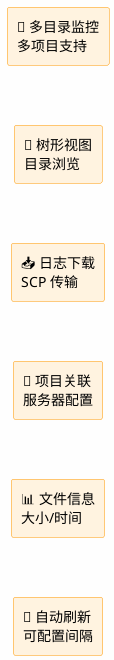
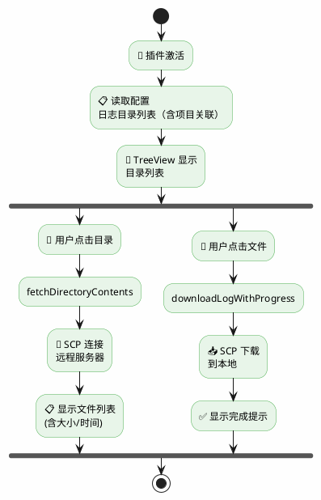
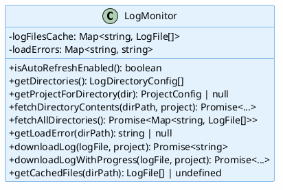
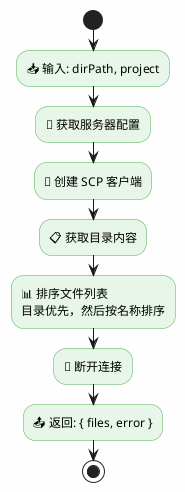
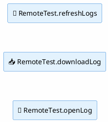
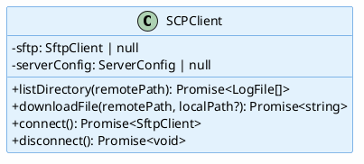
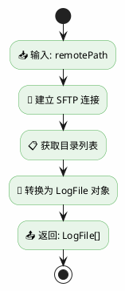

# 日志监控模块 (LogMonitor Module)

> 📋 远程日志监控引擎 - 多项目日志目录监控、浏览与下载

## 📑 目录导航

| 章节 | 描述 |
|------|------|
| [1. 模块概述](#1-模块概述) | 功能简介与核心能力 |
| [2. 架构设计](#2-架构设计) | 整体架构与工作流程 |
| [3. 类型定义](#3-类型定义) | 接口与配置定义 |
| [4. 功能实现](#4-功能实现) | 核心方法详解 |
| [5. TreeView 集成](#5-treeview-集成) | 界面集成实现 |
| [6. SCP 客户端](#6-scp-客户端集成) | 文件传输集成 |
| [7. 性能优化](#7-性能优化) | 连接池与缓存 |
| [8. 错误处理](#8-错误处理) | 异常处理机制 |

---

## 1. 模块概述

### 1.1 核心能力



### 1.2 功能特性

| 特性 | 图标 | 说明 |
|------|:----:|------|
| 多目录监控 | 📁 | 支持配置多个日志监控目录 |
| 多项目支持 | 🔗 | 日志目录可关联到特定项目 |
| 树形视图 | 🌲 | VSCode TreeView 展示目录结构 |
| 文件浏览 | 📂 | 支持递归浏览子目录 |
| 日志下载 | 📥 | 通过 SCP 下载日志文件 |
| 文件信息 | 📊 | 显示文件大小、修改时间 |
| 自动刷新 | 🔄 | 可配置自动刷新间隔 |

---

## 2. 架构设计

### 2.1 整体架构

```plantuml
@startuml
skinparam backgroundColor #FEFEFE
skinparam rectangle {
    BackgroundColor #FFF3E0
    BorderColor #FF9800
    RoundCorner 5
}

package "📋 LogMonitor Module" as Module {
    
    rectangle "📁 getDirectories()" as GetDirs
    note right of GetDirs
        从配置获取监控目录列表
        （含项目关联）
    end note
    
    rectangle "📂 fetchDirectoryContents(path, project)" as FetchDir
    note right of FetchDir
        通过 SCP 获取远程目录内容
        （使用项目服务器配置）
    end note
    
    rectangle "📊 fetchAllDirectories()" as FetchAll
    note right of FetchAll
        获取所有配置目录的内容
        （含连接间隔优化）
    end note
    
    rectangle "📥 downloadLog(logFile, project)" as Download
    note right of Download
        通过 SCP 下载远程日志文件
    end note
    
    rectangle "📥 downloadLogWithProgress(logFile, project)" as DownloadProgress
    note right of DownloadProgress
        带进度提示的下载功能
    end note
    
    rectangle "⚠️ getLoadError(dirPath)" as GetError
    note right of GetError
        获取目录加载错误信息
    end note
    
    GetDirs -> FetchDir
    FetchDir -> FetchAll
    Download -> DownloadProgress
}

@enduml
```



### 2.2 工作流程



### 2.3 多项目支持

**🔗 多项目日志监控**:

**日志目录配置属性:**

| 属性 | 类型 | 说明 |
|------|------|------|
| name | string | 目录在界面显示的名称 |
| path | string | 远程服务器上的目录路径 |
| projectName | string? | 关联的项目名称（可选） |

**关联项目后:**

- ✅ 自动使用项目配置的服务器连接信息
- ✅ 日志下载到项目配置的 downloadPath
- ✅ 界面显示项目名称便于识别

---

## 3. 类型定义

### 3.1 日志目录配置

```typescript
interface LogDirectoryConfig {
    name: string;           // 目录显示名称，如 "应用日志"
    path: string;           // 远程目录路径，如 "/var/log/myapp"
    projectName?: string;   // 关联的项目名称（可选）
}
```

### 3.2 日志文件/目录接口

```typescript
interface LogFile {
    name: string;           // 文件/目录名，如 "app.log" 或 "subdir"
    path: string;           // 完整路径，如 "/var/logs/app.log"
    size: number;           // 大小（字节）
    modifiedTime: Date;     // 最后修改时间
    isDirectory: boolean;   // 是否为目录
}
```

### 3.3 项目日志配置接口

```typescript
interface ProjectLogsConfig {
    directories: LogDirectoryConfig[];  // 监控目录列表
    downloadPath: string;               // 下载路径
}
```

### 3.4 配置示例

```json
{
    "projects": [
        {
            "name": "项目A",
            "localPath": "D:\\projectA",
            "server": { "host": "192.168.1.100" },
            "logs": {
                "directories": [
                    { "name": "应用日志", "path": "/var/log/projectA/app" },
                    { "name": "测试日志", "path": "/var/log/projectA/test" }
                ],
                "downloadPath": "D:\\downloads\\projectA"
            }
        },
        {
            "name": "项目B",
            "localPath": "D:\\projectB",
            "server": { "host": "192.168.1.200" },
            "logs": {
                "directories": [
                    { "name": "应用日志", "path": "/var/log/projectB/app" }
                ],
                "downloadPath": "D:\\downloads\\projectB"
            }
        }
    ],
    "refreshInterval": 0
}
```

---

## 4. 功能实现

### 4.1 类结构



### 4.2 核心方法

#### fetchDirectoryContents



### 4.3 辅助函数

#### formatSize(bytes: number): string

**📊 文件大小格式化**:

| 输入 | 输出 |
|------|------|
| 512 | "   512 B" |
| 2048 | "   2.0 KB" |
| 5242880 | "   5.0 MB" |
| 1073741824 | "   1.0 GB" |

**特点**: 左对齐，固定宽度

#### formatDate(date: Date): string

**📅 日期格式化**:

| 输入 | 输出 |
|------|------|
| new Date() | "2024/1/15 10:30:00" |

**特点**: 使用本地化格式 (zh-CN)

---

## 5. TreeView 集成

### 5.1 TreeView 层级结构

**🌲 TreeView 层级结构**:

```
📋 日志监控 (TreeView)
├── 📁 应用日志 (项目A)
│   ├── 📁 subdir1
│   │   ├── 📄 log1.log
│   │   └── 📄 log2.log
│   ├── 📄 app.log    2.0 KB | 2024/1/15 10:30:00
│   └── 📄 error.log  512 B | 2024/1/15 09:00:00
├── 📁 测试日志 (项目A)
│   └── 📄 test.log
├── 📁 应用日志 (项目B)
│   └── 📄 app.log
└── ⚠️ 加载失败: Connection refused
```

### 5.2 TreeItem 类型

| 类型 | 图标 | contextValue | 说明 |
|------|:----:|--------------|------|
| 配置目录 | 📁 | logDirectory | 顶级配置目录 |
| 子目录 | 📁 | logSubDirectory | 子目录 |
| 文件 | 📄 | logFile | 日志文件 |

### 5.3 命令注册

**📋 命令列表**:



**RemoteTest.refreshLogs:**
- 刷新日志列表

**RemoteTest.downloadLog:**
- 下载日志文件

**RemoteTest.openLog:**
- 下载并打开日志文件

---

## 6. SCP 客户端集成

### 6.1 类结构



### 6.2 listDirectory 流程



---

## 7. 性能优化

### 7.1 SSH 连接池

**🔌 SSH 连接池机制**:

**连接池特性:**

- ✅ 单例模式管理所有 SSH 连接
- ✅ 相同服务器配置复用连接
- ✅ 空闲连接自动清理（60秒超时）
- ✅ 最大连接数限制（10个）

**连接池配置:**

- IDLE_TIMEOUT = 60000      // 空闲超时：60秒
- CLEANUP_INTERVAL = 30000  // 清理间隔：30秒
- maxConnections = 10       // 最大连接数

### 7.2 按服务器分组加载

**📊 按服务器分组加载优化**:

**优化前:**

- N 个目录 = N 次 SSH 连接

```
目录1 ──► 连接1 ──► 断开1
目录2 ──► 连接2 ──► 断开2
目录3 ──► 连接3 ──► 断开3
...
```

**优化后:**

- N 个目录 / M 个服务器 = M 次 SSH 连接

```
服务器A: 连接 ──► 目录1, 目录2, 目录3 ──► 断开
服务器B: 连接 ──► 目录4, 目录5 ──► 断开
...
```

### 7.3 其他优化

| 优化项 | 图标 | 说明 |
|--------|:----:|------|
| 缓存机制 | 💾 | 使用 logFilesCache 缓存已加载的目录内容 |
| 懒加载 | 📂 | 按需加载目录内容，只在用户展开时获取 |
| 连接间隔 | ⏱️ | 目录加载之间增加 50ms 间隔 |
| 错误隔离 | 🛡️ | 单个目录加载失败不影响其他目录 |

---

## 8. 错误处理

**⚠️ 错误处理机制**:

| 错误场景 | 处理方式 |
|----------|----------|
| SCP 连接失败 | 返回空数组和错误信息，界面显示错误 |
| 目录不存在 | 返回空数组和错误信息 |
| 下载目录创建失败 | 抛出异常 |
| 文件下载失败 | 显示错误提示 |
| 尝试下载目录 | 抛出异常，显示提示 |
| 未配置下载路径 | 抛出异常，显示提示 |

---

## 9. 测试覆盖

| 测试类型 | 图标 | 测试文件 |
|---------|:----:|---------|
| 文件大小格式化 | 📊 | `test/suite/logMonitor.test.ts` |
| 日期格式化 | 📅 | `test/suite/logMonitor.test.ts` |
| 日志文件对象创建 | 📄 | `test/suite/logMonitor.test.ts` |
| 日志目录对象 | 📁 | `test/suite/logMonitor.test.ts` |
| 文件排序测试 | 📋 | `test/suite/logMonitor.test.ts` |
| 项目关联测试 | 🔗 | `test/suite/logMonitorProject.test.ts` |
| 错误处理测试 | ⚠️ | `test/suite/logMonitor.test.ts` |
| SCP 客户端集成 | 🔌 | `test/suite/logMonitor.test.ts` |
| 下载功能测试 | 📥 | `test/suite/logMonitor.test.ts` |

---

[返回顶部](#日志监控模块-logmonitor-module)
