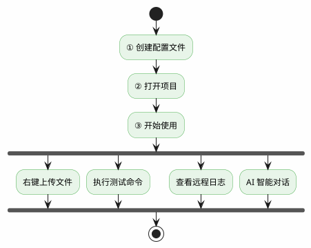
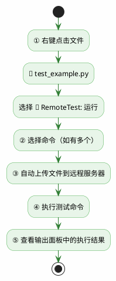
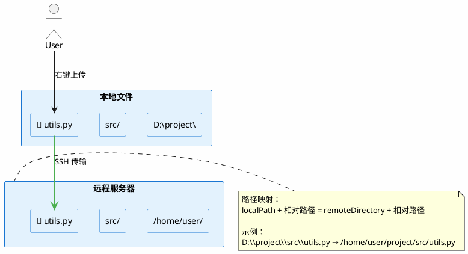
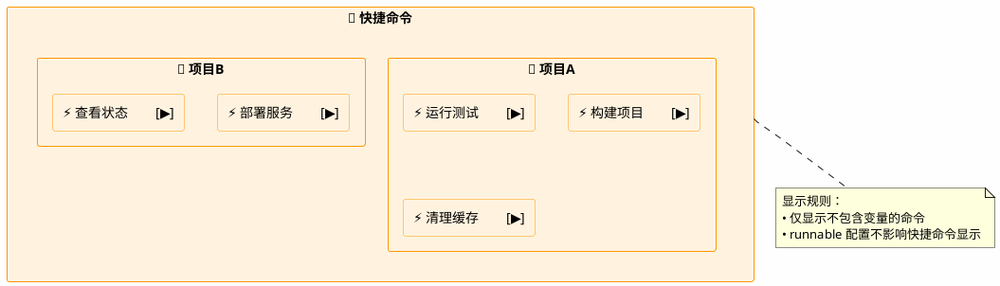
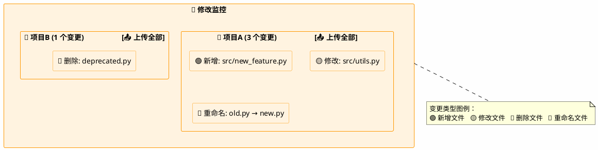
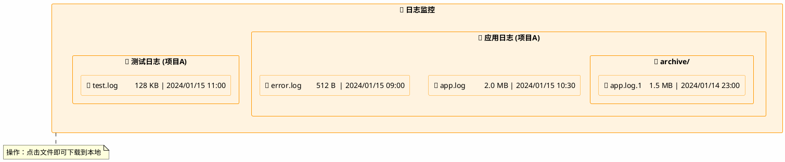
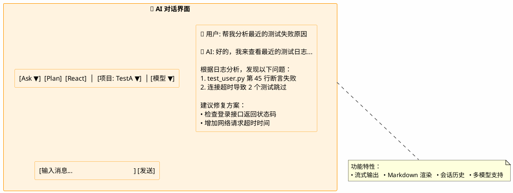

# 📖 RemoteTest 用户指南

<div align="center">

**快速上手 RemoteTest，提升远程开发效率**

[快速开始](#-快速开始) • [配置说明](#-配置文件) • [功能详解](#-功能说明) • [常见问题](#-常见问题)

</div>

---

## 📑 目录

- [快速开始](#-快速开始)
- [配置文件](#-配置文件)
- [功能说明](#-功能说明)
- [常见问题](#-常见问题)

---

## 🚀 快速开始

### 第一步：创建配置文件

在项目根目录创建 `.vscode/RemoteTest-config.json` 文件：

```
你的项目/
├── .vscode/
│   └── RemoteTest-config.json    ← 配置文件位置
├── src/
└── ...
```

### 第二步：基础配置

```json
{
  "projects": [
    {
      "name": "我的项目",
      "localPath": "D:\\myproject",
      "server": {
        "host": "192.168.1.100",
        "port": 22,
        "username": "root",
        "password": "your-password"
      },
      "remoteDirectory": "/home/user/myproject",
      "commands": [
        {
          "name": "运行测试",
          "executeCommand": "pytest {filePath} -v"
        }
      ]
    }
  ]
}
```

### 第三步：开始使用



### 功能入口速查

| 功能 | 图标 | 入口 |
|:----:|:----:|------|
| 运行用例 | 🏃 | 右键文件 → RemoteTest: 运行 |
| 上传文件 | 📤 | 右键文件 → RemoteTest: 上传文件 |
| 同步文件 | 🔄 | 右键文件 → RemoteTest: 同步文件 |
| 快捷命令 | ⚡ | 资源管理器 → 快捷命令面板 |
| 修改监控 | 👀 | 资源管理器 → 修改监控面板 |
| 日志监控 | 📋 | 资源管理器 → 日志监控面板 |
| AI 对话 | 🤖 | 活动栏 → RemoteTest AI 图标 |

---

## ⚙️ 配置文件

### 完整配置示例

```json
{
  "projects": [
    {
      "name": "项目A",
      "localPath": "D:\\projectA",
      "enabled": true,
      "server": {
        "host": "192.168.1.100",
        "port": 22,
        "username": "root",
        "password": "",
        "privateKeyPath": "C:\\Users\\user\\.ssh\\id_rsa",
        "remoteDirectory": "/tmp/projectA"
      },
      "commands": [
        {
          "name": "运行测试",
          "executeCommand": "pytest {filePath} -v",
          "runnable": true,
          "clearOutputBeforeRun": true,
          "includePatterns": ["ERROR", "FAILED", "PASSED"]
        },
        {
          "name": "构建项目",
          "executeCommand": "npm run build",
          "runnable": false
        }
      ],
      "logs": {
        "directories": [
          { "name": "应用日志", "path": "/var/log/projectA" }
        ],
        "downloadPath": "D:\\downloads\\projectA"
      }
    }
  ],
  "ai": {
    "models": [
      {
        "name": "qwen-turbo",
        "provider": "qwen",
        "apiKey": "your-qwen-api-key"
      },
      {
        "name": "gpt-4",
        "provider": "openai",
        "apiKey": "your-openai-api-key"
      },
      {
        "name": "local-llm",
        "provider": "openai",
        "apiUrl": "http://localhost:8000/v1/chat/completions"
      }
    ],
    "defaultModel": "qwen-turbo",
    "proxy": "proxy.company.com:8080"
  },
  "refreshInterval": 0,
  "useLogOutputChannel": true
}
```

### 配置结构图

```plantuml
@startuml
skinparam backgroundColor #FEFEFE
skinparam handwritten false
skinparam package {
    BackgroundColor #FFF3E0
    BorderColor #FF9800
}
skinparam rectangle {
    BackgroundColor #E3F2FD
    BorderColor #1976D2
}

package "RemoteTest-config.json" #FFF3E0 {
    
    package "projects[]" #E8F5E9 {
        rectangle "name: string\n# 项目名称" as p1
        rectangle "localPath: string\n# 本地工程路径" as p2
        rectangle "enabled: boolean\n# 是否启用" as p3
        
        package "server" #F3E5F5 {
            rectangle "host: string\n# 服务器地址" as s1
            rectangle "port: number\n# SSH 端口" as s2
            rectangle "username: string\n# 用户名" as s3
            rectangle "password: string\n# 密码认证" as s4
            rectangle "privateKeyPath: string\n# 密钥认证" as s5
            rectangle "remoteDirectory: string\n# 远程目录" as s6
        }
        
        package "commands[]" #FFF9C4 {
            rectangle "name: string\n# 命令名称" as c1
            rectangle "executeCommand: string\n# 执行命令" as c2
            rectangle "runnable: boolean\n# 是否可运行" as c3
            rectangle "includePatterns: []\n# 包含模式" as c4
            rectangle "excludePatterns: []\n# 排除模式" as c5
        }
        
        package "logs" #E0F7FA {
            package "directories[]" {
                rectangle "name: string\n# 显示名称" as l1
                rectangle "path: string\n# 远程路径" as l2
            }
            rectangle "downloadPath: string\n# 下载路径" as l3
        }
    }
    
    package "ai" #FCE4EC {
        package "models[]" {
            rectangle "name: string\n# 模型名称" as a1
            rectangle "provider: string\n# 提供商" as a2
            rectangle "apiKey: string\n# API 密钥" as a3
            rectangle "apiUrl: string\n# API 地址" as a4
        }
        rectangle "defaultModel: string\n# 默认模型" as a5
        rectangle "proxy: string\n# 代理设置" as a6
    }
}

@enduml
```



### 项目配置 (ProjectConfig)

| 字段 | 必填 | 说明 |
|:----:|:----:|------|
| `name` | ✅ | 项目名称 |
| `localPath` | ❌ | 本地工程路径（绝对路径） |
| `enabled` | ❌ | 是否启用，默认 true |
| `server` | ✅ | 服务器连接配置 |
| `commands` | ❌ | 命令配置数组 |
| `logs` | ❌ | 日志监控配置 |

### 服务器配置 (ServerConfig)

| 字段 | 必填 | 说明 |
|:----:|:----:|------|
| `host` | ✅ | 服务器 IP 地址 |
| `port` | ✅ | SSH 端口，默认 22 |
| `username` | ✅ | SSH 用户名 |
| `password` | ❌ | SSH 密码（密码认证） |
| `privateKeyPath` | ❌ | SSH 私钥路径（密钥认证，优先于密码） |
| `remoteDirectory` | ❌ | 远程工作目录（绝对路径） |

### 命令配置 (CommandConfig)

| 字段 | 说明 |
|:----:|------|
| `name` | 命令名称 |
| `executeCommand` | 执行命令（支持变量替换） |
| `runnable` | 是否在"运行用例"中显示，默认 false |
| `clearOutputBeforeRun` | 执行前是否清空输出，默认 true |
| `includePatterns` | 包含匹配模式（正则表达式） |
| `excludePatterns` | 排除匹配模式（正则表达式） |

### 命令变量

| 变量 | 说明 | 配置要求 |
|:----:|------|----------|
| `{filePath}` | 远程文件完整路径 | 需要 localPath + remoteDirectory |
| `{fileName}` | 远程文件名 | 需要 localPath + remoteDirectory |
| `{fileDir}` | 远程文件所在目录 | 需要 localPath + remoteDirectory |
| `{localPath}` | 本地文件完整路径 | 需要 localPath |
| `{localDir}` | 本地文件所在目录 | 需要 localPath |
| `{localFileName}` | 本地文件名 | 需要 localPath |
| `{remoteDir}` | 远程工程目录 | 需要 remoteDirectory |

### AI 配置

| 字段 | 说明 |
|:----:|------|
| `models` | 模型配置列表 |
| `models[].name` | 模型名称 |
| `models[].provider` | 提供商类型：`qwen` 或 `openai` |
| `models[].apiKey` | API 密钥（可选） |
| `models[].apiUrl` | 自定义 API 地址（可选） |
| `defaultModel` | 默认模型名称 |
| `proxy` | 全局代理，格式 `host:port` |

**provider 说明**：
- `qwen`：通义千问 API 格式
- `openai`：OpenAI API 格式（兼容大多数本地模型如 Ollama、vLLM）

### 全局配置

| 字段 | 说明 |
|:----:|------|
| `refreshInterval` | 日志刷新间隔（毫秒），0 表示禁用自动刷新 |
| `useLogOutputChannel` | 输出通道类型，true 带时间戳，false 无时间戳 |
| `textFileExtensions` | 额外的文本文件扩展名列表 |

---

## 📋 功能说明

### 🏃 运行用例

将文件上传到远程服务器并执行配置的测试命令。



### 📤 上传文件

仅上传文件到远程服务器，不执行命令。



### 🔄 同步文件

从远程服务器下载文件或目录到本地。

### ⚡ 快捷命令

快速执行预定义命令，无需选择文件。



### 👀 修改监控

基于 Git 检测项目变更，一键上传所有修改文件。



### 📋 日志监控

查看和下载远程服务器日志。



### 🤖 AI 对话

与 AI 助手进行对话交流。



---

## ❓ 常见问题

### Q: 路径配置有什么要求？

**A**: 所有路径必须使用绝对路径：

| 配置项 | 路径类型 | 示例 |
|:------:|:--------:|------|
| `localPath` | 本地绝对路径 | `D:\Projects\Test` |
| `privateKeyPath` | 本地绝对路径 | `C:\Users\user\.ssh\id_rsa` |
| `remoteDirectory` | 远程绝对路径 | `/tmp/RemoteTest` |
| `logs.directories[].path` | 远程绝对路径 | `/var/log/app` |
| `logs.downloadPath` | 本地绝对路径 | `D:\downloads` |

### Q: 如何配置 SSH 密钥认证？

**A**: 配置 `privateKeyPath` 字段，优先级高于密码认证：

```json
{
  "server": {
    "host": "192.168.1.100",
    "username": "root",
    "privateKeyPath": "C:\\Users\\user\\.ssh\\id_rsa"
  }
}
```

### Q: 如何使用本地部署的模型？

**A**: 配置 `apiUrl` 并设置 `provider` 为 `openai`：

```json
{
  "ai": {
    "models": [
      {
        "name": "local-model",
        "provider": "openai",
        "apiUrl": "http://localhost:8000/v1/chat/completions"
      }
    ]
  }
}
```

### Q: 为什么快捷命令不显示？

**A**: 快捷命令仅显示不包含变量的命令。如果命令包含 `{filePath}` 等变量，需要在"运行用例"功能中使用。

### Q: 如何过滤命令输出？

**A**: 使用 `includePatterns` 和 `excludePatterns`：

```json
{
  "commands": [
    {
      "name": "运行测试",
      "executeCommand": "pytest {filePath} -v",
      "includePatterns": ["ERROR", "FAILED", "PASSED"],
      "excludePatterns": ["traceback"]
    }
  ]
}
```

### Q: 功能可用性说明

| 功能 | localPath | remoteDirectory | commands | logs |
|:----:|:---------:|:---------------:|:--------:|:----:|
| 快捷命令（无变量） | - | - | ✅ | - |
| 快捷命令（本地变量） | ✅ | - | ✅ | - |
| 快捷命令（远程变量） | - | ✅ | ✅ | - |
| 文件上传 | ✅ | ✅ | - | - |
| Git 变更监控 | ✅ | - | - | - |
| 日志监控 | - | - | - | ✅ |
| 运行用例 | ✅ | ✅ | ✅ | - |

> ✅ 表示必需，- 表示不依赖

---

## 📚 相关文档

| 文档 | 说明 |
|------|------|
| [设计文档](./design.md) | 系统架构和模块设计 |
| [配置文档](./config.md) | 配置项详细说明 |
| [AI 模块](./ai.md) | AI 对话功能说明 |
| [Agent 模式](./agent.md) | Agent 设计和实现 |

---

<div align="center">

**遇到问题？[提交 Issue](https://github.com/your-repo/remotetest/issues) 获取帮助**

</div>
